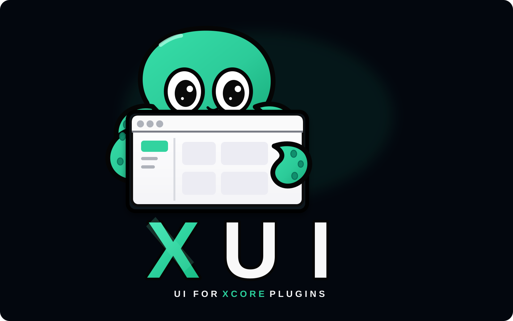

<p align="center">
  
</p>

<h1 align="center">xui</h1>
<p align="center"><strong>Server-rendered UI SDK for XCore plugins.</strong></p>

---

**xui** est un SDK de pages web server-rendues pour les plugins
[xcore](https://pypi.org/project/xcoreruntime/) : un kit de 50 composants
interactifs `<ui.x>`, un moteur de pages sécurisé (RBAC + CSRF), et une
navigation cross-plugin — le tout en Jinja2, sans build frontend, sans CDN,
sans imposer quoi que ce soit aux plugins.

```
┌─────────────────────────────────────────────────────────────┐
│  Browser                                                     │
│    GET page  ·  POST formulaire   (1 requête = 1 action)     │
└───────────────┬─────────────────────────────────────────────┘
                ▼
   xcore  ──  FastAPI
      ├─ UI plugins (mode xui)   ← rendu par xui
      │     mount_xui_page()  →  UIContext (RBAC/)  →  TemplateEngine
      │     <ui.button/> <ui.dialog/> <ui.datepicker/> …
      ├─ SPA plugins (mode spa)  ← aucun import xui exigé
      └─ routes POST explicites  ← mutations, jamais de dispatcher
```

## Pourquoi xui existe

Les plugins xcore ont besoin d'interfaces, et il y a deux façons de les
faire : un frontend séparé (React/Vue/Svelte + build + API JSON) — puissant,
mais lourd pour des pages d'administration et de paramétrage —, ou des pages
rendues par le serveur — rapides à écrire, inséparables de la logique métier.
**xui est cette seconde voie**, pensée pour l'écosystème xcore :

- **Le serveur reste la seule source de vérité.** `ctx.require_role(...)`
  dans une vue de page et `RBACChecker(["..."])` sur une route API lisent le
  même `AuthPayload`, résolu par la même fonction. Aucune logique de
  sécurité côté client — le navigateur ne décide jamais.
- **Aucun runtime imposé.** Pas de dispatcher générique, pas de bus
  d'événements, pas d'URL opaques : chaque action est un `<form method="post">`
  ou un `fetch()` vers une **route FastAPI que le plugin écrit lui-même**.
  C'est auditable, ça passe par le pipeline de sécurité existant, et ça
  ne bride personne.
- **Rendu par le vrai moteur.** xui ne réinvente pas Jinja : il consomme le
  `TemplateEngine` de microframe, qui résout templates, layouts et
  composants. Un projet xui reste un projet de templates normal.
- **Sans xcore requis à l'import.** Le SDK s'importe seul ; seul le montage
  d'une page exigera xcore, au moment de l'appel. Un plugin SPA pur peut
  utiliser les composants xui sans dépendre du kernel.

## Ce que xui apporte

| Brique | Détail |
|---|---|
| **50 composants `{ui.x}`** | `button`, `card`, `badge`, `tabs`, `accordion`, `menu`, `select`, `combobox`, `dialog`, `drawer`, `tooltip`, `popover`, `toast`, `calendar`, `datepicker`, `switch`, `range`… — interactifs (Alpine), prêts à l'emploi, sans build |
| **Pages sécurisées** | `mount_xui_page()` : résolution de l'utilisateur, `require_role`, redirection login/403, injection auto de la nav et du contexte |
| **Formulaires ré-affichables** | `parse_form()` (Pydantic) rend à la page ses messages d'erreur par champ et les valeurs déjà saisies — pas de 422 JSON |
| **Navigation cross-plugin** | `NavRegistry` : chaque plugin enregistre ses entrées, l'arbre est filtré par les rôles de l'utilisateur |
| **Composants partagés entre plugins** | `UIPackageRegistry` : un plugin exporte des callables UI, les autres les résolvent au rendu, sans copies |
| **CSRF ciblé** | Middleware qui ne protège que les routes cookie-authentifiées mutatives — jamais les routes `Bearer` (pas de credential ambiant = pas de risque) |
| **Headers / CSP souple** | `SecurityHeadersMiddleware` : nosniff, `X-Frame-Options: DENY`, Referrer-Policy, CSP en report-only par défaut, durcissable en prod |
| **Assets auto-hébergés** | CSS + Alpine 3.17 vendorés avec le SDK : pas de CDN, version verrouillée, fonctionne hors-ligne |

## Démarrer en trois lignes

```bash
uv pip install -e ../microframe && uv sync --extra xcore
uv run uvicorn main:app --reload     # → http://localhost:8000
uv run pytest                        # → 47 tests
```

> Le paquet PyPI `microframe` est un numpy sans rapport (collision de nom) —
> le vrai moteur s'installe en editable depuis le sibling repo.

## Une page, vue de l'intérieur

```python
def _contacts_view(ctx: UIContext):
    ctx.require_role("sales.view")                    # RBAC, même AuthPayload que l'API
    return {"title": "Contacts", "contacts": _CONTACTS}

mount_xui_page(router, self.ctx, engine,
               path="/contacts", template="crm/contacts.html",
               view=_contacts_view)
```

```html
<ui.button href="/plugins/crm_app/contacts/new">Nouveau</ui.button>

  <ui.table>… contacts …</ui.table>
  <form method="post" action="/plugins/crm_app/contacts/new">
    <input type="hidden" name="csrf_token" value="{{ csrf_token() }}">
    <ui.input name="name" label="Nom" value="{{ values.get('name', '') }}"/>
    <ui.button type="submit" variant="primary">Créer</ui.button>
  </form>

<ui.alpine/>
```

La mutation (`POST /contacts/new`) est une route FastAPI ordinaire du plugin,
validée en CSRF par le middleware et en RBAC par le même `UIContext`.

## Lire la suite

- [`docs/spec-v1.md`](docs/spec-v1.md) — la spec technique et ses principes
  fondateurs (§0 à ne manquer sous aucun prétexte).
- [`docs/architecture.md`](docs/architecture.md) — module par module du SDK.
- [`docs/components.md`](docs/components.md) — catalogue des 50 composants.
- [`docs/plugins.md`](docs/plugins.md) — écrire un plugin avec xui.
