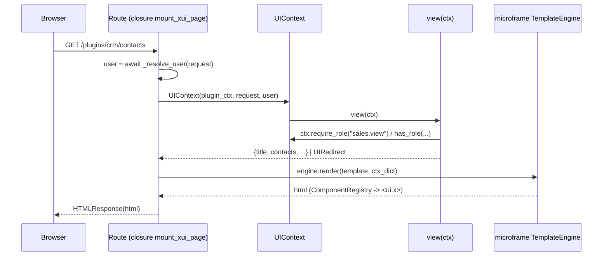

# Architecture du SDK xui

Ce document décrit la codebase module par module (le package `xui/`), le
flux d'une requête, et les décisions de conception qui l'ont façonnée.

## Vue d'ensemble

```
Browser
   │  HTTP (GET page / POST formulaire) — 1 requête = 1 action
   ▼
FastAPI app (main.py démo : xcore + microframe + xui)
   │
   ├── CSRFMiddleware (xui.csrf)   ── protège les routes cookie-authentifiées
   ├── Setup kernel xcore.setup()  ── tenancy, tracing (avant le démarrage)
   ├── mount_template_static()     ── templates/static -> /static
   ├── mount_builtin_assets()      ── xui/static/ -> /xui-static  (assets SDK)
   └── Routers de plugins (get_router()) via xcore.boot()
         ├── mount_xui_page()   -> page server-rendue (mode xui)
         ├── montage SPA/proxy  -> mode spa|hybrid
         └── routes POST explicites -> mutation (formulaire)
```

### Flux d'une page XUI (GET)

1. `mount_xui_page()` déclare la route et enferme la logique dans une closure.
2. À la requête : `_resolve_user(request)` (le **même** résolveur que
   `get_current_user`) donne l'`AuthPayload`.
3. Un `UIContext(plugin_ctx, request, user)` est construit et passé à la vue.
4. La vue fait des `ctx.require_role(...)`, retourne un dict (contexte de
   template) ou un `UIRedirect`.
5. `render_xui_template()` rend le template via `TemplateEngine.render()`,
   en injectant automatiquement `nav`, `static`, `user`, `request`.
6. `UIPermissionDenied` est intercepté : anonyme → 303 vers login, sinon 403.



## Modules

### `xui/__init__.py` — point d'entrée

- Exporte l'API publique (`__all__`) : `UIContext`, `UIPermissionDenied`,
  `UIRedirect`, `mount_xui_page`, `render_xui_template`,
  `mount_plugin_static`, `mount_spa`, `mount_dev_proxy`,
  `mount_spa_or_proxy`, `mount_builtin_assets`, `FormResult`, `parse_form`.
- **Auto-enregistrement des composants** à l'import : appelle
  `microframe.engine.components.auto_register_ui_components` sur
  `xui/components/` — tout projet qui dépend de xui a les 50 composants
  `<ui.x>` disponibles sans copier de fichiers. Silencieux si microframe
  n'est pas installé (plugin `mode=spa` pur).

### `xui/context.py` — contexte de page

```python
@dataclass
class UIContext:
    plugin_ctx: PluginContext
    request: Request
    user: AuthPayload | None
```

- `get_service(name)` → délègue à `plugin_ctx.get_service`.
- `call_plugin(plugin, action, payload)` → via `plugin_ctx.caller`, avec la
  même convention de nommage que `TrustedBase.call_plugin`.
- `has_role(*roles)` / `require_role(*roles)` → lit **le même** `AuthPayload`
  que `get_current_user`/`RBACChecker` (union `roles` + `permissions`).
  `require_role` lève `UIPermissionDenied` si absent.
- `redirect(path, code=303)` → retourne `UIRedirect`, que le dispatcher
  transforme en `RedirectResponse`.

**Découplage xcore** : les types `AuthPayload`/`PluginContext` sont importés
sous `TYPE_CHECKING` et tombent sur `Any` si le kernel est absent — le SDK
(composants, CSRF, forms, mounts) s'importe et s'utilise **sans xcore**.
Seul `mount_xui_page` exige xcore à l'appel (résolution de l'utilisateur).
Ce découplage est verrouillé par `tests/test_sans_xcore.py`.

### `xui/mount.py` — montage de pages / assets / SPA

| Fonction | Rôle |
|---|---|
| `mount_xui_page(router, plugin_ctx, engine, *, path, template, view, methods=("GET",), login_path="/login")` | Monte UNE page server-rendue. `view: PageView` = `Callable[[UIContext], dict \| UIRedirect \| Awaitable[...]]`. Gère login 303 / 403. |
| `render_xui_template(engine, template, plugin_ctx, request, user, extra, status_code)` | Ré-affiche un template hors flux normal (re-rendu POST après erreur de validation). |
| `mount_builtin_assets(app, url_prefix="/xui-static")` | Sert `xui/static/` (CSS/JS vendorés des composants) — un seul appel au niveau app. |
| `mount_plugin_static(router, static_dir, url_path="/static")` | Sert le dossier statique d'un plugin sous son routeur (→ `/plugins/<name>/static/`). Silencieux si absent. |
| `mount_spa(router, dist_dir)` | Sert un build SPA compilé : `/assets` + fallback `index.html` sur `/{full_path:path}`. Zéro dépendance microframe. |
| `mount_dev_proxy(router, dev_server)` | Reverse-proxy HTTP vers un dev server front vivant (Vite). **HTTP only**, pas de pass-through WS (HMR Vite non supporté). |
| `mount_spa_or_proxy(router, *, dist_dir, dev_server)` | Bascule : `dev_server` préféré, sinon `dist_dir` (sinon erreur). |

**Nettoyage header de proxy** : `host`/`content-length` (req) et
`content-length`/`transfer-encoding`/`connection` (resp) sont exclues pour
éviter les interférences entre le client et l'upstream.

### `xui/nav.py` — navigation cross-plugin

```python
NavNode(id, label, plugin, path=None, icon=None, parent_id=None, order=100, permission=None)
NavRegistry.register(node)  # ValueError si id en collision
NavRegistry.unregister_plugin(plugin_name)  # retrait au hot-reload
NavRegistry.tree(user_roles=None)  # arbre filtré par roles, trié (order, label), enfants récursifs
registry = NavRegistry()  # singleton de module
```

- Le kernel ne fournit **pas** le slot `KernelContext.nav` prévu par la spec
  (§3/§7) : le registre vit en singleton de module (divergence assumée et
  documentée — les commentaires signalent où la spec et le code diffèrent).
- Chaque plugin enregistre ses nœuds dans `on_load()`, les retire dans
  `on_unload()` (le kernel n'appelle pas `unregister_plugin` pour nous).
- `tree(user_roles)` filtre par `permission` (rôle utilisateur, jamais
  `PermissionEngine` plugin-à-plugin — ne pas confondre les deux systèmes).

### `xui/packages.py` — packages UI cross-plugin

```python
UIPackageRegistry.register(package_id, plugin_name, exports)
UIPackageRegistry.get(package_id, export_name)
UIPackageRegistry.unregister_plugin(plugin_name)
registry = UIPackageRegistry()  # singleton de module
```

- Partage de composants UI entre plugins par `package_id` (reverse-domain,
  ex. `com.xcore.ui_kit`) + `exports` (callables Python rendant du HTML).
- **Règle d'usage** : `get()` se fait **au moment du rendu**, jamais à
  l'import-time du module — sinon référence périmée après un hot-reload du
  plugin exportateur (pattern documenté dans `docs/plugins.md`).
- Divergence spec : pas de vérification topo au boot (le kernel installé n'a
  pas de hook `_topo_sort` étendu UI) — `get()` échoue avec un message clair
  au premier accès manquant.

### `xui/csrf.py` — protection des mutations cookie-authentifiées

```python
CSRFMiddleware(app, get_token: Callable[[], str], protected_paths: Sequence[str])
```

- Ne traite que : méthode dans `MUTATING_METHODS` **et** chemin sous
  `protected_paths` **et** cookie `session` présent. Un POST sans cookie de
  session (auth Bearer pure) passe sans contrôle — pas de credential ambiant,
  pas de risque CSRF (spec §10).
- Le champ attendu est `csrf_token` dans le body du formulaire, comparé au
  token de `get_token()` (le `TemplateEngine.csrf_token`, secret stable par
  process, exposé aux templates via `{{ csrf_token() }}`).
- Mauvais/absent token → `403 {"error": "csrf_invalid"}`.
- **`get_token` est un callable**, pas un engine, car l'engine n'existe
  qu'après `await xcore.boot(app)` (trop tard pour `add_middleware`, que
  Starlette refuserait après démarrage).
- **Rejeu du body** : `BaseHTTPMiddleware` relance l'app interne avec le
  `receive()` d'origine ; on draine donc les bytes bruts puis on remplace
  `request._receive` par une closure qui les rejoue, avant `call_next` —
  sinon les routes verraient un formulaire vide.

### `xui/security.py` — en-têtes de sécurité / CSP

Jamais de promesse de durcissement : CSP **souple par défaut** en
`report-only`.

```python
DEFAULT_CSP  # script/style 'self' 'unsafe-inline' (layouts + html() inline) + base-uri 'self'
SecurityHeadersMiddleware(app, *, csp=None, report_only=True, exclude_paths=())
```

- Même exutoire que `csrf_token()` : `report_only=True` par défaut — on
  accumule les violations en logs, on ne casse pas les pages de démo à
  l'inline.
- Pose toujours `X-Content-Type-Options: nosniff`, `X-Frame-Options: DENY`,
  `Referrer-Policy: strict-origin-when-cross-origin` ; CSP via
  `Content-Security-Policy-Report-Only`.
- `report_only=False` → CSP stricte à activer en prod une fois les pages sans
  inline ; `exclude_paths` pour les chemins qui ne doivent jamais porter
  d'en-tête.

Vendue optionnelle dès l'install (toujours activable sans doute d'absence) :
testée dans `tests/test_security.py`.

### `xui/forms.py` — validation de formulaires Pydantic

```python
FormResult(data, errors: dict[str, str], values: dict[str, str])  # .ok
parse_form(form: FormData, model) -> FormResult[ModelT]
```

- Pas d'injection FastAPI (`Annotated[Model, Form()]`) : sur échec, FastAPI
  renvoie un 422 JSON, inutilisable pour une page HTML. `parse_form` valide
  explicitement dans la route (toujours une route FastAPI ordinaire).
- `values` = toutes les entrées string du `FormData` (pour ré-afficher les
  valeurs déjà saisies) ; `errors` = message par champ (`loc` joint par `.`
  pour les champs de sous-modèles, `__root__` sinon).
- Le re-rendu avec erreurs se fait via `render_xui_template(..., status_code=422)`.

## Flux de configuration de l'app démo (`main.py`, hors SDK)

Ordre sensible (documenté dans `xui/csrf.py` et `xui/security.py`) :

1. `FastAPI(lifespan=...)`.
2. `app.add_middleware(CSRFMiddleware, ...)` **avant** le démarrage, avec un
   `get_token` paresseux (`lambda: _engine().csrf_token`).
3. `xcore.setup(app)` — middlewares kernel — aussi avant startup, jamais dans
   `lifespan()`.
4. Dans `lifespan()` : `await xcore.boot(app)`, puis
   `mount_template_static(app, "templates", "/static")` et
   `mount_builtin_assets(app)`.
5. On n'appelle **jamais** `bind_engine()` / `register_action_routes()`
   (microframe) : c'est le dispatcher `<action>`/`<remote>` qu'interdit la
   spec §15. Le `_action_resolver` du moteur reste vide, `<action>` retombe
   sur `href="#"` (mort, sans risque).

## MFE (micro-frontends) — état actuel

microframe livre un `MFEClient` (`microframe/engine/mfe/client.py`) instancié
par `TemplateEngine` (`engine.mfe`) et exposé au templating par le global
`render_mfe(name, **kwargs)` : GET HTTP affecté au rendu, fragment renvoyé en
`Markup`, tout échec → commentaire HTML inoffensif. Ni xui ni les plugins ne
le câblent aujourd'hui : `engine.mfe.register(...)` (via `register_many`)
n'est appelé nulle part, donc tout `render_mfe` retomberait sur
`<!-- MFE 'x' not found -->`. Acté comme non-branché (pas construit par
anticipation) ; la bascule dédiée reste la route de fragment explicite
(`docs/plugins.md`, spec §6).

## Périmètre acté hors scope

Ce qui suit est **acté** (décidé, pas oublié) ; on ne construit rien par
anticipation. Quand un cas d'usage réel l'exigera, on rouvrira l'item avec
la spec `docs/spec-v1.md` en référence.

| Élément (spec) | État | Bascule opérationnelle |
|---|---|---|
| WS `/plugins/{name}/live` (§11) | non construit | push server→client uniquement — ne jamais y mettre de HTML ou de décision d'auth ; le client `fetch()` la route de fragment/API pour les données. |
| `mount_dev_proxy` WebSocket | pas de pass-through WS | HMR Vite non supporté à travers le proxy ; dev via `vite --host` sans HMR. |
| Manifeste `ui.packages` / `ui.mode` ✓ | non consommé par le kernel installé | résolution par code : `mount_spa_or_proxy` + `UIPackageRegistry.register()` à `on_load()`. |
| `PluginContext.plugin_dir` (§3) | gap | dériver le chemin de `__file__` (`Path(__file__).resolve().parent.parent`). |
| Topo-sort `ui.packages` au boot (§8) | pas de hook `_topo_sort` UI | `registry.get(...)` au rendu — échec clair au premier accès manquant. |
| `NavRegistry`/`UIPackageRegistry` wirés kernel | singletons de module | hot-reload : `unregister_plugin()` dans `on_unload()`. |
| CSP strict (self-only) | souple par défaut (`report_only=True`) | passer `report_only=False` en prod (`xui/security.py`), durcissement quand les templates n'auront plus d'inline. |
| MFE (`rendered_mfe`) | client branché, registre vide | route de fragment dédiée (§6) en attendant. |
| Dispatcher `<action>`/`<remote>` (§15) | interdit | routes POST explicites + CSRF. |

Lire chaque divergence dans son module ci-dessus pour le « pourquoi ».

## Moments cruciaux à retenir

- **Installation de microframe** : le paquet PyPI `microframe` est un projet
  numpy sans rapport. Le vrai moteur s'installe en editable depuis le sibling
  repo : `uv pip install -e ../microframe`.
- **`mount_dev_proxy` ne pompe pas le WS** : HMR Vite ne fonctionne pas à
  travers lui (documenté, hors scope).
- **`xui.egg-info/` doit rester synchronisé** avec `pyproject.toml`
  (package-data `components/*.html`, `static/cotton-ui/*`, `static/alpine/*`)
  — régénérer `SOURCES.txt` après toute modif de package-data.